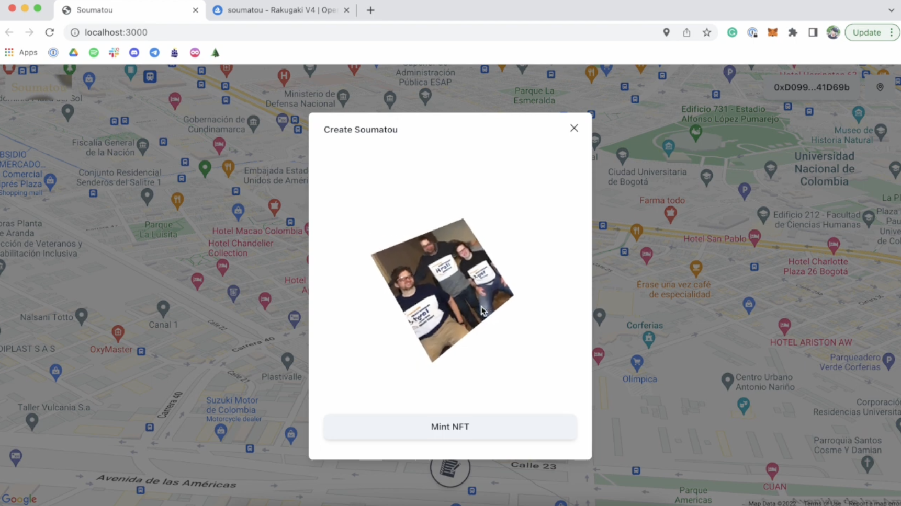

## Soumatou

### Concept

Soumatou transforms everyday moments you never want to forget into 3d art, inscribing the place and time on the blockchain forever.

### Description

Users can input the memory text with the location data on the map. Then the image is generated by the text, and the image is converted to a 3D model, then the 3D model is minted as NFT in Klaytn Blockchain.

### How it is made

The map is using google map API. Image generation is using stable diffusion. The 3D model is using three.js. NFT Metadata management is using NFTStorage. NFT is minted in Klaytn testnet.

### Metaverse

The NFT is a 3D object with memory, and it can be used for future development of the "Metaverse" service. In the future, memories can be decorated in virtual rooms and placed in real space via AR.

## Info

Deployed Contract
https://baobab.scope.klaytn.com/account/0x9af9ee7729efa8f3c0a897b4b8ffc6230e013cd5

Created Asset
https://testnets.opensea.io/assets/baobab/0x9af9eE7729efa8F3C0a897b4B8ffc6230E013cd5/4
